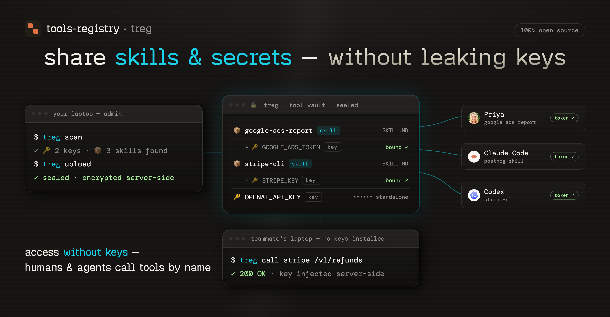

# Treg (Tool-Registry)



**Stop pasting API keys & skills into agent contexts and Slack DMs.** Treg is your team's shared registry
of skills, CLIs, endpoints, and secrets. Agents call Stripe, PostHog, `gh` directly - auth
injected server-side, every call logged. Nothing to paste, nothing to leak.

Built for the Superdesign team, live at [treg.superdesign.dev](https://treg.superdesign.dev) - anyone can self-host.

- **tool** = something the registry calls for you with the org's credential. Two kinds:
  - **endpoint** - an upstream `base_url` + credential **bindings** (each binding injects one
  secret into the request; a request can carry several, e.g. an OAuth bearer *and* a
  `developer-token` header).
  - **CLI** - a vendor binary (`stripe`, `gh`, `vercel`, ...) run with the credential injected.
- **skill / bundle** = a recipe (`SKILL.md`) + its secrets + its tool(s), registered together.

**The one rule:** the proxy **relays, never models** the upstream, and **injects auth server-side**
— so it survives upstream API changes and callers never hold keys.

---

# Part 1 · Using the registry

Visit [**treg.superdesign.dev**](https://treg.superdesign.dev) (hosted on Render) — the dashboard,
sign-in, and every URL below live there.

## Quickstart

Same flow as the dashboard's **Getting started** guide:

```bash
# 1. install the CLI — also points it at the registry
curl -fsSL https://treg.superdesign.dev/install.sh | sh

# 2. sign in (GitHub default · --email for a one-time code · --token for agents/CI)
treg login

# 3. guided setup - share your skills & keys, or connect to your team's
treg onboard
```

Your token identifies you on every call (`X-Treg-Token` header) and is the same for all tools.
Discover what your team has shared: `treg tool ls` · check credential health: `treg health`.

## Share & use tools

The zero-thought path — point treg at a project and it figures out what's shareable:

```bash
treg scan     # read-only preview: the keys, skills & CLIs upload would register
treg upload   # register them (encrypted server-side); idempotent, --replace to update
```

`treg upload` scans the `.env` (matching keys against ~80 known providers), every skill
subdirectory, and installed catalog CLIs. Three kinds of things go into the registry — here's how
to share and use each:

### 1. Endpoints (HTTP APIs)

**Share** — one upstream URL callable with a stored key, or bulk from a `.env`:

```bash
treg secret add STRIPE_KEY --value sk_live_123
treg add stripe --base-url https://api.stripe.com --secret STRIPE_KEY

treg upload env --select openai,stripe,resend     # or straight from the .env
```

**Use** — the agent-native way: build the **real** upstream request and prefix it with the proxy.
treg resolves the tool by host, injects the credential, and relays everything else faithfully
(your `X-Treg-Token` is stripped before the upstream sees it):

```
Real request:   GET https://api.intercom.io/conversations?per_page=5
Through treg:   GET https://treg.superdesign.dev/call/https://api.intercom.io/conversations?per_page=5
                    header:  X-Treg-Token: <your token>
```

Or the CLI shorthand — and `treg calls` for the audit log:

```bash
treg call intercom conversations --query per_page=5
treg call stripe v1/balance
```

### 2. CLIs

**Share** — automatic: `treg upload` detects installed catalog CLIs (`stripe`, `gh`, `vercel`, …)
and registers them; a recipe-only catalog CLI skill (e.g. `stripe-cli`) auto-becomes runnable too.

**Use** — `treg run` executes the vendor CLI **with the org's credential injected**, so you never
hold the key or log in:

```bash
treg run stripe -- get /v1/balance
treg run gh -- pr list
treg run --server agentmail-cli inboxes list   # runs on the registry server: the key never reaches you
```

`--local` (default) runs on your machine; `--server` runs on the registry and streams output back.
For a whole session, `treg shell start` opens a subshell where every registered CLI injects
automatically — just use `stripe`, `gh`, … normally; `exit` reverts. `treg runs` is the audit log.

### 3. Skills

**Share** — a skill is a whole capability (`SKILL.md` recipe + its secrets + its tool(s)),
registered together so the whole team runs the same skill, maintained in one place:

```bash
treg upload skills --dir ~/.claude/skills --all   # register a folder of skills in one pass
```

**Use** — pull any shared skill into your agent; its API calls go through treg with your token,
so the key stays in the vault, never in the skill:

```bash
treg skill install seo-blog-writer      # writes into ./.claude/skills/  (--all for the library)
```

### Manual registration — when the heuristics can't figure a tool out

```bash
# multi-credential tool (e.g. google-ads: OAuth bearer + a developer-token header)
treg tool add google-ads --base-url https://googleads.googleapis.com \
  --bind "secret=<oauth-id>,injector=oauth" \
  --bind "secret=<dev-id>,name=developer-token,format={secret}"

# one skill, step by step
treg skill init --dir ./my-skill          # drafts treg.json (guesses base_url, finds secrets)
treg skill add  --dir ./my-skill          # registers recipe + secrets + tool, atomically

# OAuth via the browser (mints the first token, treg holds it and auto-refreshes)
treg oauth connect gsc --client-secret client_secret.json \
  --scopes https://www.googleapis.com/auth/webmasters.readonly
```

Full options for every command: [`USAGE.md`](USAGE.md).

## Teams

Everything is scoped to an **org**: a token = a `(user, org)` membership, and every secret, tool,
and skill belongs to the active org. Roles: **owner / admin / member / viewer**.

```bash
treg org create "Acme"                        # make a team, become owner
treg org invite teammate@acme.com             # invite by email (pick role + tool access)
treg org join <code> --email you@acme.com     # accept an invite (creates you if new)
treg org ls | use <slug> | members            # switch orgs, see the roster
treg org access <member> --tools a,b          # per-member tool access (admin+)
```

## Going deeper

- [`USAGE.md`](USAGE.md) — the full `treg` CLI reference.
- [`/llms.txt`](https://treg.superdesign.dev/llms.txt) — the agent-onboarding file: call
protocol, discovery, auth, CLI, skills. One fetch teaches an agent the whole registry.
- **The dashboard** at [treg.superdesign.dev](https://treg.superdesign.dev) — full CRUD, a guided
tutorial (Help → Tutorial), and copyable setup instructions for your agents.
- **The API** — everything the CLI does is plain HTTP; interactive OpenAPI docs live at `/docs`.
The proxy endpoint is `/call/{...}`; all endpoints take the `X-Treg-Token` header.

---

# Part 2 · Self-hosting & development

## Run it locally

One command (needs `tmux` + [`uv`](https://docs.astral.sh/uv/); it syncs the venv itself):

```bash
scripts/dev-local.sh up        # server on http://localhost:18790, dev-safe settings
```

That runs the server in tmux with hot-reload, its own sqlite DB (`treg-dev.db`), and email OTP dev
mode (sign-in codes shown on the page — no mail sender needed). Day-to-day:

```bash
scripts/dev-local.sh cli login   # sandboxed CLI: never touches your real ~/.treg/config.json
scripts/dev-local.sh logs        # server output          · status / restart / down
scripts/dev-local.sh reset       # wipe the dev DB + CLI sandbox for a fresh start
```

Or run the server directly, without tmux:

```bash
uv sync                        # create the venv from uv.lock (pulls the server deps for dev)
uv run python -m treg          # serve on 0.0.0.0:18790 (add --reload for dev)
uv run python -m treg keygen   # print a fresh Fernet key for TREG_SECRET_KEY
```

> **Installing to run a server (not from source):** the base package is the **CLI only**. To run a
> registry, install the server extra — `pip install "tools-registry[server]"` — which adds FastAPI, the
> database drivers, and encryption. `pip install tools-registry` alone gives just the `treg` command for
> talking to an existing registry.

The team instance is hosted on **Render** (web service + Postgres) at `treg.superdesign.dev`.

## Configuration

Environment variables (prefix `TREG_`, read from `.env`):


| Var                                       | Default                         | Purpose                                                                                                                                                                    |
| ----------------------------------------- | ------------------------------- | -------------------------------------------------------------------------------------------------------------------------------------------------------------------------- |
| `TREG_DATABASE_URL`                       | `sqlite+aiosqlite:///./treg.db` | DB URL (SQLite for dev, Postgres in prod)                                                                                                                                  |
| `TREG_SECRET_KEY`                         | *(empty)*                       | Fernet key for secrets-at-rest; empty → an ephemeral key is minted (secrets won't survive a restart)                                                                       |
| `TREG_PUBLIC_URL`                         | `https://treg.superdesign.dev`  | treg's public base, used to build the OAuth callback URI                                                                                                                   |
| `TREG_SESSION_SECRET`                     | *(empty)*                       | signs the dashboard session cookie; falls back to `TREG_SECRET_KEY`. Set a real value in prod                                                                              |
| `TREG_GITHUB_CLIENT_ID` / `_SECRET`       | *(empty)*                       | GitHub OAuth sign-in (callback `<public_url>/auth/github/callback`); empty hides the button                                                                                |
| `TREG_GOOGLE_CLIENT_ID` / `_SECRET`       | *(empty)*                       | Google OAuth sign-in (redirect `<public_url>/auth/google/callback`); empty hides the button                                                                                |
| `TREG_RESEND_API_KEY` / `TREG_EMAIL_FROM` | *(empty)*                       | transactional email via Resend (OTP codes + invites); From must be a Resend-verified sender                                                                                |
| `TREG_ADMIN_TOKEN`                        | *(empty)*                       | cross-tenant **super-admin** bearer; authorizes every `/admin/*` endpoint. Empty disables the env path (only `is_superadmin` users reach `/admin`). Keep it long + secret. |
| `TREG_EMAIL_DEV_MODE`                     | `false`                         | when true, `/auth/email/start` returns the OTP in its response (no mail sender needed) — **dev/local only**, never in prod.                                                |


No `.env` is needed for local dev — every setting has a working default (ephemeral key, sqlite).

> **⚠️ Back these up before moving or redeploying:** the Fernet key (`TREG_SECRET_KEY`) and the
> database (Postgres in prod; `treg.db` for a local sqlite run). Lose the Fernet key and every
> stored secret becomes unrecoverable.

## Architecture

**Request flow for `/call`:** resolve tool (by URL host + longest `base_url` prefix, or by name) →
decrypt its secret(s) → apply each binding's injector → stream to the upstream → fire-and-forget
audit record. The proxy does no business logic and never buffers the body.

**Module map** (`src/treg/`):


| Module                                     | Role                                                                                                             |
| ------------------------------------------ | ---------------------------------------------------------------------------------------------------------------- |
| `proxy.py`                                 | `relay()` — the whole product in one function: a faithful streaming proxy                                        |
| `injectors.py`                             | the auth-shape seam: `env`, `cli_auth`, `secret_file`, `oauth` place a secret into a header/query                |
| `oauth.py`                                 | token freshness (single-flight refresh) + the connect flow (consent URL, code exchange)                          |
| `health.py`                                | credential health: refresh oauth, probe tools, webhook the owner of anything broken                              |
| `convert.py`                               | scaffold a skill directory into a registerable bundle manifest                                                   |
| `api.py`                                   | the API — the only brain; CLI + skill are thin clients over it                                                   |
| `cli.py`                                   | the `treg` CLI                                                                                                   |
| `models.py`                                | SQLModel tables: `Org`, `User`, `Membership`, `Invite`, `Secret`, `Tool`, `Bundle`, `PendingOAuth`, `CallRecord` |
| `crypto.py` `config.py` `db.py` `audit.py` | Fernet encryption + tokens · settings · async DB · deferred audit writer                                         |


**The 4 auth shapes** (per binding `injector`): `env` (plain string / API key) · `secret_file` (a
JSON token file, pull a field) · `oauth` (a JSON OAuth token, auto-refreshed if refreshable) ·
`cli_auth` (material lifted from a CLI's keychain).

**Faithful-relay contract:** the proxy alters **only** three things, everything else is verbatim:

1. hop-by-hop transport headers (re-derived per hop),
2. treg's own control + edge-forwarding headers (`x-treg-token`, `x-treg-org`,
`ngrok-skip-browser-warning`, `x-forwarded-*`, `via`, …) and treg's session cookie — all stripped,
never leak upstream,
3. the injected credential(s).

**OAuth, three ways to get the first token:** *manual upload* (drop in a `token.json`) ·
*auto-refresh* (if the token carries `refresh_token` + client creds, treg keeps it fresh, you never
re-upload) · *hosted connect flow* (`treg oauth connect` → browser consent → treg captures the
token itself).

**Health checks:** give a tool an optional probe (`{method, path, expect_status}`); a periodic run
(on demand or via cron) validates every credential, refreshes OAuth, and webhooks the owner of any
that break.

Deep design lives in [`docs/context/`](docs/context/README.md) (per-subsystem fragments).

## Tests

```bash
uv run pytest -q     # 521 tests
```

Coverage: proxy walking-skeleton, all injector shapes, per-user auth + CRUD + audit, skill composer,
URL-passthrough + faithful relay, OAuth refresh + connect flow, health checks, `treg run`/shell,
upload/scan, orgs + invites, the dashboard API, CLI.

## Contributing & docs

```
tools-registry/
├── src/treg/            # the package (api, cli, proxy, injectors, oauth, health, convert, models, …)
│   └── web/             # dashboard, landing, tutorial, llms.txt, skill.md, install.sh
├── tests/               # 521 tests
├── docs/
│   ├── context/         # design fragments (codemap system) + generated index
│   └── ONBOARDING.md    # first-time bootstrap
├── USAGE.md             # full treg CLI reference
└── pyproject.toml
```

Per-subsystem design docs are **fragments** in `docs/context/`, each citing its `src/treg/*`
sources. Working in this repo with an AI agent? The `/tools-registry-context` skill loads the
right fragment for what you're touching and keeps the docs in sync — run
`/tools-registry-context sync` before pushing.

**Roadmap:** MCP support · finer permission tiers · at-rest key-management hardening · possible
Loopni merge.

## License

Apache 2.0 with additional terms ([`LICENSE`](LICENSE)): use it freely — including commercially,
inside your own organization (self-hosting your own registry is encouraged) — but don't offer it
to third parties as a hosted/managed service or embed it in a commercially distributed product
without written permission (`jason@superdesign.dev`).
